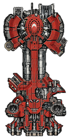
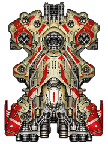
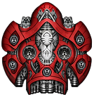
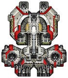
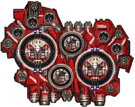
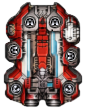

# Starsector Ships (P) Pirate

## Features

- New ship variants
- Custom ship designs
- Designed to fit the vanilla Starsector setting and gameplay

## Ships

### Apogee P-Class

### Champion P-Class

### Medusa P-Class

### Gemini P-Class

### Grendel P-Class

### Wayfarer P-Class

### Other Ships

More ships will be added here.

## Requirements

- Starsector **0.98a-RC8**
- No additional dependencies

## Installation

1. Download the latest release.
2. Extract the `Ships (P) Pirate` folder.
3. Move it to your Starsector `mods` folder.
4. Launch Starsector.
5. Enable **Ships (P) Pirate** in the mod manager.

## Known Issues

- None currently known.

## Changelog

### Version 1.1.0 - 1.0.0
- Initial release
- New ship variants
- Custom ship designs
- Designed to fit the vanilla Starsector setting and gameplay

## Credits

Created by **Zuttser**.

## License

This project is licensed under the MIT License.
See the [LICENSE](LICENSE) file for details.

